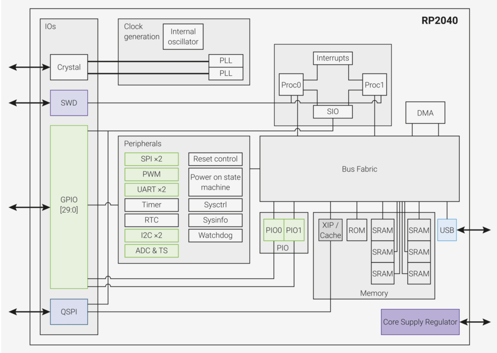
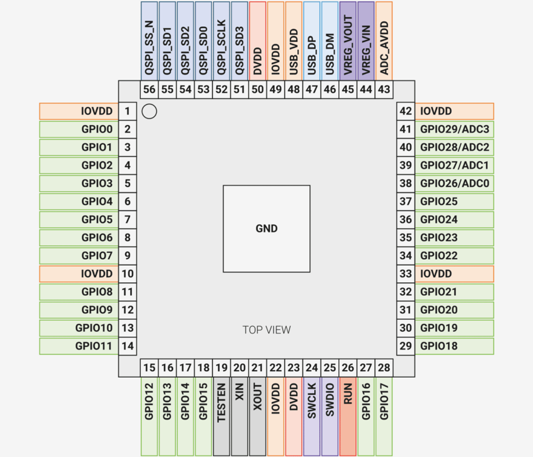
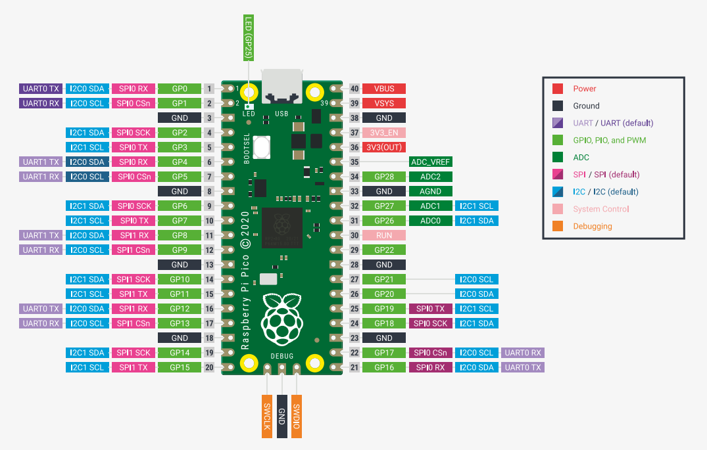

# SPI based Digital Temperature Monitor using RP2040
This project demonstrates how to use the RP2040’s PIO (Programmable I/O) as an SPI slave to transmit internal temperature sensor data to a master device. It is written in MicroPython, and developed using Thonny IDE on a Raspberry Pi Pico demoboard.
## Table of Contents
<ul>
  <li><a href="#rp2040">Introduction to RP2040 Microcontroller</a></li>
  <li><a href="#raspberrypi">Introduction to Raspberry Pi</a></li>
</ul>

## 1-Introduction to RP2040 Microcontroller
The RP2040 is a 32-bit dual-core ARM Cortex-M0+ microcontroller designed by Raspberry Pi, known for its high performance, low cost, and ease of use, featuring a rich set of peripherals and unique Programmable I/O (PIO) subsystem. 
### 1.1-Key Features

- **Dual-core ARM Cortex-M0+** @ 133MHz
- **264kB** of embedded **SRAM** in 6 banks
- 6 dedicated IO for **16MB** external **QSPI Flash** with **eXecute In Place (XIP)**
- **4 channel ADC with internal temperature sensor, 500ksps, 12-bit conversion**
- **30** multi-function General Purpose IO
- Dedicated hardware for commonly used peripherals
   - **2 UARTs**
   - **2 SPI** controllers
   - **16 PWM** channels
   - **USB 1.1 Host/Device**
     
- **8 Programmable IO** state machine for extended peripheral support
### 1.2-Block Diagram

### 1.3-Pinout

For more details on GPIO pin functions and internal peripheral mappings, refer to the official [RP2040 Datasheet](https://datasheets.raspberrypi.com/rp2040/rp2040-datasheet.pdf).Each GPIO pin on the RP2040 is connected to various internal peripherals (like SPI,UART,I2C etc.) , offering high flexibility for custom I/O functions.SIO, PIO0 and PIO1 are connected to all GPIO pins and are controlled by software (or software controlled state machines) so can be used to implement
many functions.

## 2-Introduction to Raspberry Pi

The RP2040 microcontroller is used in various Raspberry Pi boards, including the Pico, Pico W, Pico H, and Pico WH. For this project, we are using the Raspberry Pi Pico as our development platform.
### 2.1-Key Features

- **USB 1.1 Micro-B Port** – Used for power, programming, and USB communication (host/device).
- **2 MB Flash Memory** – On-board QSPI flash for storing code and data.
- **40-Pin Header** – With 26 multifunctional GPIOs supporting UART, SPI, I2C, ADC, PWM, etc.
- **3-Pin Debug Header** – For low-level debugging via external tools.
- **Power Supply Circuitry** – Accepts 1.8V–5.5V input with onboard 3.3V regulation.
- **BOOTSEL Button** – For entering USB mass storage mode to flash new firmware.
- **On-Board LED** – User-controllable LED connected to GPIO25.

### 2.2-Pin Configuration

- **Total physical pins on the Pico board: 40**
- **RP2040 supports 30 GPIOs: `GPIO0` to `GPIO29`**
- **26 GPIOs are exposed** via the 40-pin header:
    - **`GPIO0`** to **`GPIO22`** → Available on header
    - **`GPIO25`** → Connected to onboard LED
    - **`GPIO26`**–**`GPIO28`** → Used as **ADC0–ADC2**
- **GPIOs not exposed on pin header:**
    - **`GPIO23`** & **`GPIO24`** → Used **internally for QSPI Flash**
    - **`GPIO29`** → Connected **internally to the onboard temperature sensor (ADC3)** and not accessible as a regular GPIO
- **Analog Inputs (ADC):**
    - **`ADC0`** → **`GPIO26`**
    - **`ADC1`** → **`GPIO27`**
    - **`ADC2`** → **`GPIO28`**
    - **`ADC3`** → Internal Temperature Sensor (**`GPIO29`**, not exposed)
- **Power Pins:**
    - **`VBUS`**: 5V from USB
    - **`VSYS`**: Main power input (1.8V–5.5V)
    - **`3V3`**: Regulated 3.3V output
    - **`GND`**: Multiple ground pins
    - **`3V3_EN`**: Enable pin for 3.3V regulator (pull low to disable)
    - **`ADC_VREF`**: Reference voltage for ADC (defaults to 3.3V)
- **Debug Pins:**
    - **`SWDIO`** and **`SWCLK`** are used for debugging (Single Wire Debug)

For more details, refer to the official [Raspberry Pi Pico Datasheet](https://datasheets.raspberrypi.com/pico/pico-datasheet.pdf).

#### 2.3-Pin Mappings of RPi

### SPI Pin Mapping
The RP2040 has two built-in SPI interfaces — called SPI0 and SPI1 — which can be connected to different GPIO pins. This flexibility helps us choose the best pins based on our circuit or board layout. The table below shows which GPIOs can be used for each SPI function (like SCK, MOSI, MISO, CS) so we can easily set up SPI communication on your Raspberry Pi Pico.

| **SPI Instance** | **Chip Select (CS)** | **SCK (Clock)**    | **MOSI (TX)**      | **MISO (RX)**      |
|------------------|----------------------|---------------------|--------------------|--------------------|
| **SPI0**         | `GPIO1`,`GPIO5`,`GPIO17`| `GPIO2`,`GPIO6`,`GPIO18`| `GPIO3`,`GPIO7`, `GPIO19`|`GPIO0`,`GPIO4`,`GPIO16`|
| **SPI1**         | `GPIO9`,`GPIO13`      |`GPIO10`,`GPIO14`   | `GPIO11`, `GPIO115`     | `GPIO8`, `GPIO12`      |

