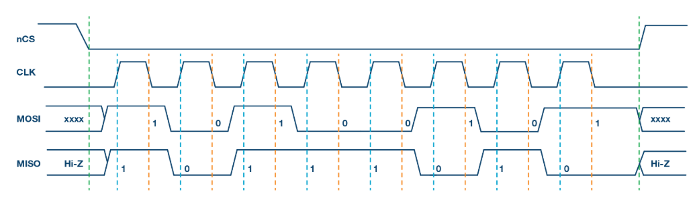

# SPI based Digital Temperature Monitor using RP2040
This project utilizes the RP2040's Programmable I/O (PIO) to implement an SPI slave that transmits internal temperature sensor data to a master device. It is written in MicroPython and developed using Thonny IDE on a Raspberry Pi Pico demoboard.
## Table of Contents
<ul>
  <li><a href="#rp2040">Introduction to RP2040 Microcontroller</a></li>
  <li><a href="#raspberrypi">Introduction to Raspberry Pi</a></li>
  <li><a href="#spi">Serial Peripheral Interface</a></li>
</ul>

## 1-Introduction to RP2040 Microcontroller
The RP2040 is a 32-bit dual-core ARM Cortex-M0+ microcontroller designed by Raspberry Pi, known for its high performance, low cost, and ease of use, featuring a rich set of peripherals and unique Programmable I/O (PIO) subsystem. 
### 1.1-Key Features

- **Dual-core ARM Cortex-M0+** @ 133MHz
- **264kB** of embedded **SRAM** in 6 banks
- 6 dedicated IO for **16MB** external **QSPI Flash** with **eXecute In Place (XIP)**
- **4 channel ADC with internal temperature sensor, 500ksps, 12-bit conversion**
- **30** multi-function General Purpose IO
- Dedicated hardware for commonly used peripherals
   - **2 UARTs**
   - **2 SPI** controllers
   - **16 PWM** channels
   - **USB 1.1 Host/Device**
     
- **8 Programmable IO** state machine for extended peripheral support
### 1.2-Block Diagram

### 1.3-Pinout

The RP2040 supports SPI, UART, I²C, and PIO on all GPIO pins from 0 to 29. However, not all of these pins are physically accessible on the Raspberry Pi Pico board (or other demoboard)—some are used internally or not broken out. So, for any practical project, we must use only the GPIOs that are physically available on the Pico’s pin headers. 
For more details on GPIO pin functions and internal peripheral mappings, refer to the official [RP2040 Datasheet](https://datasheets.raspberrypi.com/rp2040/rp2040-datasheet.pdf).Each GPIO pin on the RP2040 is connected to various internal peripherals (like SPI,UART,I2C etc.) , offering high flexibility for custom I/O functions.SIO, PIO0 and PIO1 are connected to all GPIO pins and are controlled by software (or software controlled state machines) so can be used to implement
many functions.

## 2-Introduction to Raspberry Pi

The RP2040 microcontroller is used in various Raspberry Pi boards, including the Pico, Pico W, Pico H, and Pico WH. For this project, we are using the Raspberry Pi Pico as our development platform.
### 2.1-Key Features

- **USB 1.1 Micro-B Port** – Used for power, programming, and USB communication (host/device).
- **2 MB Flash Memory** – On-board QSPI flash for storing code and data.
- **40-Pin Header** – With 26 multifunctional GPIOs supporting UART, SPI, I2C, ADC, PWM, etc.
- **3-Pin Debug Header** – For low-level debugging via external tools.
- **Power Supply Circuitry** – Accepts 1.8V–5.5V input with onboard 3.3V regulation.
- **BOOTSEL Button** – For entering USB mass storage mode to flash new firmware.
- **On-Board LED** – User-controllable LED connected to GPIO25.

### 2.2-Pin Configuration

- **Total physical pins on the Pico board: 40**
- **RP2040 supports 30 GPIOs: `GPIO0` to `GPIO29`**
- **26 GPIOs are exposed** via the 40-pin header:
    - **`GPIO0`** to **`GPIO22`** → Available on header
    - **`GPIO25`** → Connected to onboard LED
    - **`GPIO26`**–**`GPIO28`** → Used as **ADC0–ADC2**
- **GPIOs not exposed on pin header:**
    - **`GPIO23`** & **`GPIO24`** → Used **internally for QSPI Flash**
    - **`GPIO29`** → Connected **internally to the onboard temperature sensor (ADC3)** and not accessible as a regular GPIO
- **Analog Inputs (ADC):**
    - **`ADC0`** → **`GPIO26`**
    - **`ADC1`** → **`GPIO27`**
    - **`ADC2`** → **`GPIO28`**
    - **`ADC3`** → Internal Temperature Sensor (**`GPIO29`**, not exposed)
- **Power Pins:**
    - **`VBUS`**: 5V from USB
    - **`VSYS`**: Main power input (1.8V–5.5V)
    - **`3V3`**: Regulated 3.3V output
    - **`GND`**: Multiple ground pins
    - **`3V3_EN`**: Enable pin for 3.3V regulator (pull low to disable)
    - **`ADC_VREF`**: Reference voltage for ADC (defaults to 3.3V)
- **Debug Pins:**
    - **`SWDIO`** and **`SWCLK`** are used for debugging (Single Wire Debug)

For more details, refer to the official [Raspberry Pi Pico Datasheet](https://datasheets.raspberrypi.com/pico/pico-datasheet.pdf).

### 2.3-Pin Mappings of RPi

#### SPI Pin Mapping
The RP2040 has two built-in SPI interfaces — called SPI0 and SPI1 — which can be connected to different GPIO pins. This flexibility helps us choose the best pins based on our circuit or board layout. The table below shows which GPIOs can be used for each SPI function (like SCK, MOSI, MISO, CS) so we can easily set up SPI communication on your Raspberry Pi Pico.

| **SPI Instance** | **Chip Select (CS)** | **SCK (Clock)**    | **MOSI (TX)**      | **MISO (RX)**      |
|------------------|----------------------|---------------------|--------------------|--------------------|
| **SPI0**         | `GPIO1`,`GPIO5`,`GPIO17`| `GPIO2`,`GPIO6`,`GPIO18`| `GPIO3`,`GPIO7`, `GPIO19`|`GPIO0`,`GPIO4`,`GPIO16`|
| **SPI1**         | `GPIO9`,`GPIO13`      |`GPIO10`,`GPIO14`   | `GPIO11`, `GPIO115`     | `GPIO8`, `GPIO12`      |

#### I2C Pin Mapping
The RP2040 supports two I²C interfaces — named I2C0 and I2C1. Like SPI, these can be connected to multiple GPIO pins using flexible pin mapping.

| **I2C Interface** | **SDA**                          | **SCL**                          |
|------------------|-----------------------------------------------|-----------------------------------------------|
| **I2C0**          | `GPIO0`,`GPIO4`,`GPIO8`, `GPIO12`, `GPIO16`, `GPIO20`   | `GPIO1`,`GPIO5`,`GPIO9`, `GPIO13`, `GPIO17`, `GPIO21`   |
| **I2C1**          | `GPIO2`, `GPIO6`, `GPIO10`, `GPIO14`, `GPIO18`, `GPIO26`  | `GPIO3`, `GPIO7`, `GPIO11`, `GPIO15`, `GPIO19`, `GPIO27`  |

#### UART Pin Mapping 
The RP2040 includes two UART interfaces — UART0 and UART1 — which can also be connected to different GPIOs using internal routing.

| **UART Interface** | **TX**                        | **RX**                        |
|--------------------|--------------------------------------------|--------------------------------------------|
| **UART0**          | `GPIO0`, `GPIO12`, `GPIO16`                      | `GPIO1`, `GPIO13`, `GPIO17`                      |
| **UART1**          | `GPIO4`, `GPIO8`                     | `GPIO5`, `GPIO9`                  |

#### PIO Pin Mapping
On the Raspberry Pi Pico board, most GPIO pins are accessible and can be used for PIO. However, GPIO23, GPIO24, GPIO25 and GPIO29 (ADC3) are either used internally (like LED or voltage monitoring) or not exposed via the physical headers, so they are not available for general-purpose PIO use in most projects.

### 2.4-RP2040 to Raspberry Pi Pico GPIO Mapping Schematic
This diagram shows how the internal GPIO pins of the RP2040 microcontroller are connected to the physical pins of the Raspberry Pi Pico board.

## 3-SPI-Serial Peripheral Interface
SPI is a synchronous, full-duplex serial communication bus with three or more signals. It is **synchronous** because of the presence of a dedicated clock line shared between all nodes. The clock helps all devices taking part in the communication to remain in sync. This increases the effective data rate on the line while reducing errors. **Full-duplex** means data can be sent and received at the same time using the dedicated data lines. In a standard application, there will be four signal lines.
  - **MOSI**-This stands for Master Out Slave In or Controller Out Peripheral In (COPI) . This pin is the data output pin for the Central device but also at the same time, the data input pin for the Peripheral         device.
  - **MISO**-This stands for Master In Slave Out or Controller In Peripheral Out(CIPO) . This pin is the data output of the Peripheral node and thus the data input pin for the Central node.
  - **SCK**-This is the common Serial Clock line shared between all devices. Only the Central node can generate the clock. All other devices must read the clock.
  - **CS**-Chip Select is the line used to select a device on the bus. Each node needs a separate CS line for selecting that device. The state of the CS line will be `HIGH` by default when the device is not selected. To select the device, a Central node must pull the CS line of that device to `LOW`.

Only one device can generate a clock signal on the SCK line at a time. This device with the role of generating the SPI clock is called a Central node, also called Master in obsolete terms. All other devices will act like Peripheral (or Slave) nodes at this time.

Since only the Central node can generate the clock, only a central node can initiate a data transfer. Therefore, SPI communication must employ a Command-Response scheme for communication. A Central node can pull the CS pin of a node LOW and then send some command to it. Upon receiving the command, the Peripheral node starts sending the response data. The Central must maintain the clock signal for the period of time the peripheral is sending data.

### 3.1-Clock Polarity and Clock Phase
In SPI, the main can select the clock polarity and clock phase. The CPOL bit sets the polarity of the clock signal during the idle state. The idle state is defined as the period when CS is high and transitioning to low at the start of the transmission and when CS is low and transitioning to high at the end of the transmission. The CPHA bit selects the clock phase. Depending on the CPHA bit, the rising or falling clock edge is used to sample and/or shift the data. The main must select the clock polarity and clock phase, as per the requirement of the subnode. Depending on the CPOL and CPHA bit selection, four SPI modes are available.

| **SPI Mode** | **CPOL** | **CPHA** | **Clock Polarity in Idle State** | **Clock Phase Used to Sample and/or Shift the Data** |
|--------------|----------|----------|----------------------------------|------------------------------------------------------|
| 0            | 0        | 0        | Logic low                        | Data sampled on rising edge and shifted out on falling edge |
| 1            | 0        | 1        | Logic low                        | Data sampled on falling edge and shifted out on rising edge |
| 2            | 1        | 0        | Logic high                       | Data sampled on falling edge and shifted out on rising edge |
| 3            | 1        | 1        | Logic high                       | Data sampled on rising edge and shifted out on falling edge |

We will be using **MODE 1** in our project.

In this mode, clock polarity is 0, which indicates that the idle state of the clock signal is low. The clock phase in this mode is 1, which indicates that the data is sampled on the falling edge (shown by the orange dotted line) and the data is shifted on the rising edge (shown by the dotted blue line) of the clock signal.

